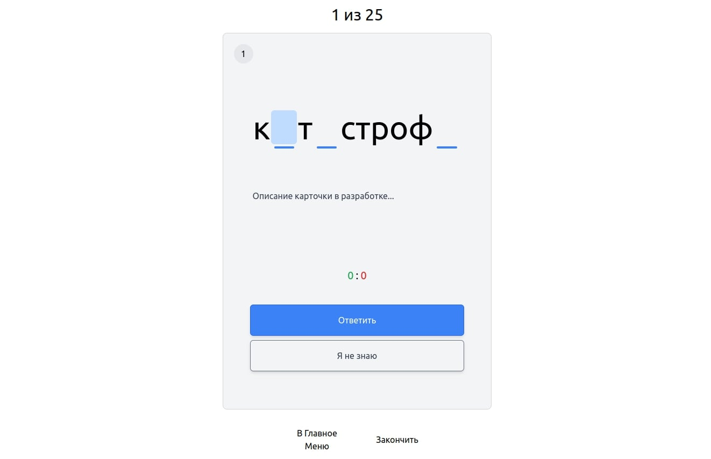
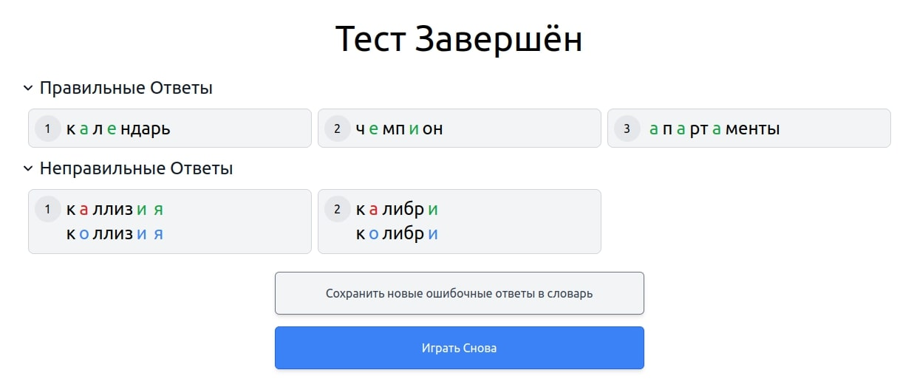

<h1 align="center">
    Guess The Letter
</h1>
<p align="center">
    <a href="https://boggerbyte.github.io/Guess-The-Letter/">
        
    </a>
    <a href="https://github.com/BoggerByte/Guess-The-Letter/blob/main/LICENSE">
        
    </a>
</p>
<p align="center">
    <em>Simple game that will quickly teach you how to write words correctly</em><br>
    <em>(Currently supports only russian language)</em>
</p>

> Easy to understand,
> Process and rectify mistakes conveniently,
> Create and play with your own dictionaries

---


*Game card with word «катастрофа» (eng. catastrophe)*

## Other screenshots




---

## Installation

Guess The Letter was written using **Vite**, **Svelte** and **Typescript** to build logic and **Tailwindcss** to design the website.
So this section will explain how to install the project and what each component is responsible for.

### Requirements
- npm 9.6.6

### Install
```console
$ git clone https://github.com/BoggerByte/Guess-The-Letter.git
$ npm i
```

### Run Dev Server
Dev server will be started by default at http://localhost:5173/Guess-The-Letter/
```console
$ npm run dev
```

### Build
```console
$ npm run build
```

### Code quality
```console
$ npm run check
$ npm run format
$ npm run lint
```

